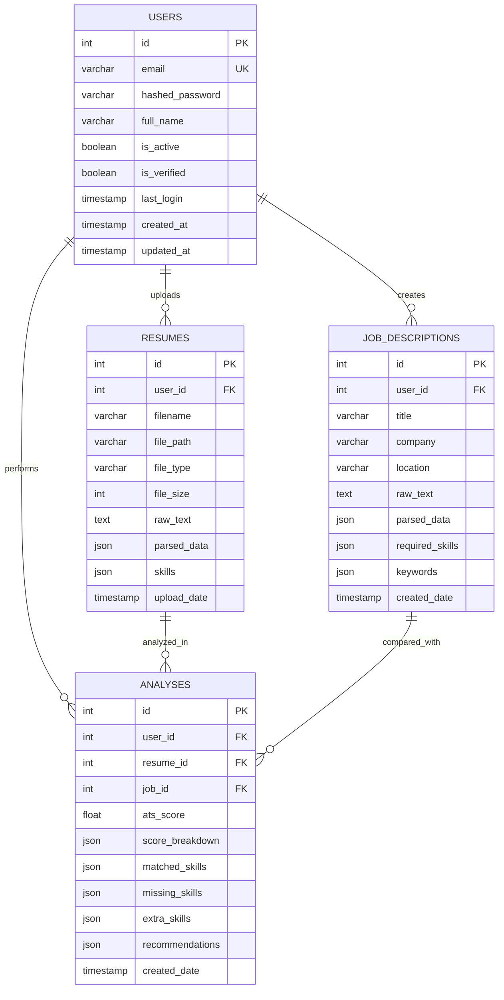
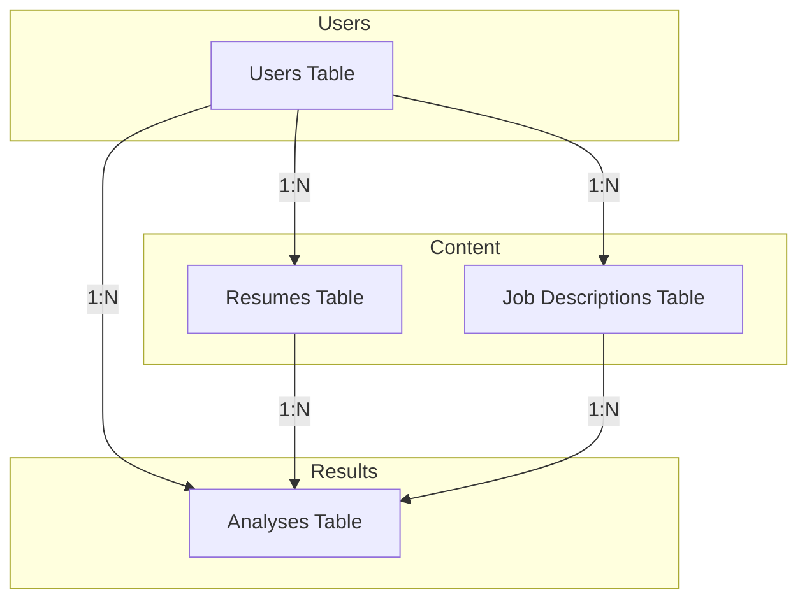
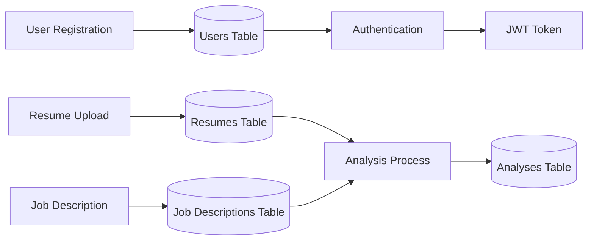
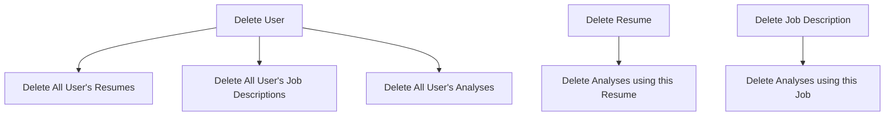

# 🗄️ Database Documentation

Complete database documentation for the AI Resume Optimizer project.

## Database Overview

This project uses PostgreSQL database to store user data, resumes, job descriptions, and analysis results.

---

## ER Diagram (Entity-Relationship)



---

## Relationships Diagram



---

## Data Flow Diagram



---

## Tables Detail

### 1. Users Table

```sql
CREATE TABLE users (
    id SERIAL PRIMARY KEY,
    email VARCHAR(255) UNIQUE NOT NULL,
    hashed_password VARCHAR(255) NOT NULL,
    full_name VARCHAR(100) NOT NULL,
    is_active BOOLEAN DEFAULT TRUE NOT NULL,
    is_verified BOOLEAN DEFAULT FALSE NOT NULL,
    last_login TIMESTAMP,
    created_at TIMESTAMP DEFAULT CURRENT_TIMESTAMP NOT NULL,
    updated_at TIMESTAMP DEFAULT CURRENT_TIMESTAMP NOT NULL
);

CREATE INDEX idx_users_email ON users(email);
```

| Column | Type | Constraints | Description |
|--------|------|-------------|-------------|
| id | SERIAL | PRIMARY KEY | Unique identifier |
| email | VARCHAR(255) | UNIQUE, NOT NULL | User email |
| hashed_password | VARCHAR(255) | NOT NULL | Argon2 hash |
| full_name | VARCHAR(100) | NOT NULL | Display name |
| is_active | BOOLEAN | DEFAULT TRUE | Account status |
| is_verified | BOOLEAN | DEFAULT FALSE | Email verified |
| last_login | TIMESTAMP | NULLABLE | Last login time |
| created_at | TIMESTAMP | NOT NULL | Creation time |
| updated_at | TIMESTAMP | NOT NULL | Update time |

---

### 2. Resumes Table

```sql
CREATE TABLE resumes (
    id SERIAL PRIMARY KEY,
    user_id INTEGER NOT NULL REFERENCES users(id) ON DELETE CASCADE,
    filename VARCHAR(255) NOT NULL,
    file_path VARCHAR(500) NOT NULL,
    file_type VARCHAR(10) NOT NULL,
    file_size INTEGER NOT NULL,
    raw_text TEXT,
    parsed_data JSONB,
    skills JSONB,
    upload_date TIMESTAMP DEFAULT CURRENT_TIMESTAMP NOT NULL
);

CREATE INDEX idx_resumes_user_id ON resumes(user_id);
```

| Column | Type | Description |
|--------|------|-------------|
| id | SERIAL | Primary key |
| user_id | INTEGER | Foreign key to users |
| filename | VARCHAR(255) | Original filename |
| file_path | VARCHAR(500) | Server storage path |
| file_type | VARCHAR(10) | pdf or docx |
| file_size | INTEGER | Size in bytes |
| raw_text | TEXT | Extracted text |
| parsed_data | JSONB | Structured data |
| skills | JSONB | Extracted skills array |
| upload_date | TIMESTAMP | Upload timestamp |

---

### 3. Job Descriptions Table

```sql
CREATE TABLE job_descriptions (
    id SERIAL PRIMARY KEY,
    user_id INTEGER NOT NULL REFERENCES users(id) ON DELETE CASCADE,
    title VARCHAR(255),
    company VARCHAR(255),
    location VARCHAR(255),
    raw_text TEXT NOT NULL,
    parsed_data JSONB,
    required_skills JSONB,
    keywords JSONB,
    created_date TIMESTAMP DEFAULT CURRENT_TIMESTAMP NOT NULL
);

CREATE INDEX idx_job_descriptions_user_id ON job_descriptions(user_id);
```

| Column | Type | Description |
|--------|------|-------------|
| id | SERIAL | Primary key |
| user_id | INTEGER | Foreign key to users |
| title | VARCHAR(255) | Job title |
| company | VARCHAR(255) | Company name |
| raw_text | TEXT | Full description |
| required_skills | JSONB | Skills array |
| keywords | JSONB | Keywords array |

---

### 4. Analyses Table

```sql
CREATE TABLE analyses (
    id SERIAL PRIMARY KEY,
    user_id INTEGER NOT NULL REFERENCES users(id) ON DELETE CASCADE,
    resume_id INTEGER NOT NULL REFERENCES resumes(id) ON DELETE CASCADE,
    job_id INTEGER NOT NULL REFERENCES job_descriptions(id) ON DELETE CASCADE,
    ats_score FLOAT NOT NULL,
    score_breakdown JSONB,
    matched_skills JSONB,
    missing_skills JSONB,
    extra_skills JSONB,
    matched_keywords JSONB,
    missing_keywords JSONB,
    recommendations JSONB,
    created_date TIMESTAMP DEFAULT CURRENT_TIMESTAMP NOT NULL
);

CREATE INDEX idx_analyses_user_id ON analyses(user_id);
CREATE INDEX idx_analyses_resume_id ON analyses(resume_id);
CREATE INDEX idx_analyses_job_id ON analyses(job_id);
```

---

## JSON Field Structures

### score_breakdown
```json
{
    "skills_score": 85,
    "keywords_score": 78,
    "experience_score": 82,
    "format_score": 90,
    "achievements_score": 75
}
```

### skills (Resumes)
```json
["Python", "JavaScript", "React", "PostgreSQL", "Docker"]
```

### recommendations (Analyses)
```json
[
    {
        "priority": "high",
        "category": "skills",
        "message": "Add Docker experience",
        "details": "Docker is required for this position"
    },
    {
        "priority": "medium",
        "category": "keywords",
        "message": "Include 'microservices' keyword",
        "details": "Job description mentions microservices"
    }
]
```

---

## Cascade Delete Rules



---

## Database Operations

### Backup
```bash
docker exec resume_db pg_dump -U postgres resume_optimizer > backup.sql
```

### Restore
```bash
docker exec -i resume_db psql -U postgres resume_optimizer < backup.sql
```

### Connect
```bash
docker exec -it resume_db psql -U postgres -d resume_optimizer
```

### Common Queries
```sql
-- Get user's analysis history
SELECT a.*, r.filename, j.title 
FROM analyses a
JOIN resumes r ON a.resume_id = r.id
JOIN job_descriptions j ON a.job_id = j.id
WHERE a.user_id = 1
ORDER BY a.created_date DESC;

-- Get average score per user
SELECT user_id, AVG(ats_score) as avg_score
FROM analyses
GROUP BY user_id;
```

---

## Connection Configuration

```python
DATABASE_URL = "postgresql://postgres:password123@db:5432/resume_optimizer"

engine = create_engine(
    DATABASE_URL,
    pool_pre_ping=True,
    pool_size=10,
    max_overflow=20
)
```

---

## Security

- **Password Hashing**: Argon2 algorithm
- **SQL Injection Protection**: SQLAlchemy ORM
- **Cascade Deletes**: Proper foreign key constraints
- **Indexes**: Optimized for common queries