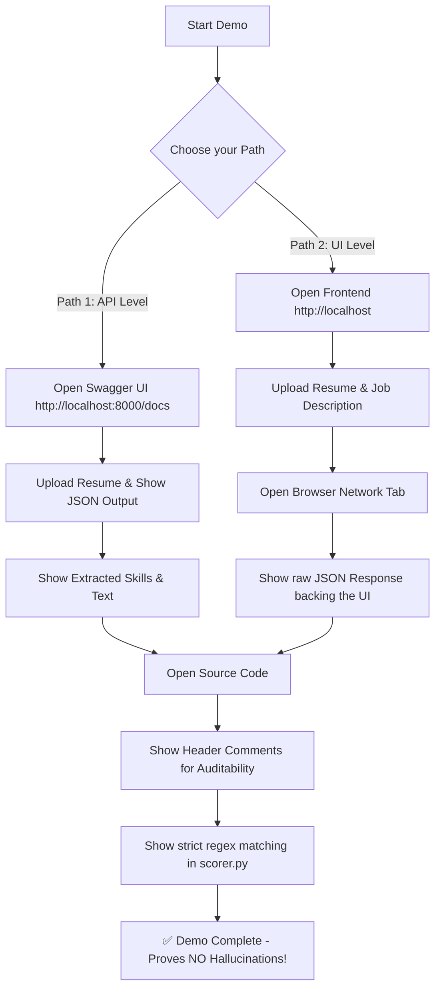

k# 🎓 System Demonstration Guide

> [!IMPORTANT]
> This guide outlines how to effectively demonstrate the backend ML engine and API functionality, proving that the system actively extracts text, skills, and strictly matches them without relying on third-party AI hallucinations.

## 🗺️ Demonstration Workflow

## Method 1: The FastAPI Swagger UI (Backend Data View)

The most professional way to display the raw backend data execution is through the built-in Swagger UI.

1. Ensure the Docker containers are running (`docker-compose up -d`).
2. Open your browser and go to: **[http://localhost:8000/docs](http://localhost:8000/docs)**
3. This is the interactive API documentation. You can test endpoints directly here.

### Demonstrating Resume Extraction:
1. Scroll down to the **`POST /api/v1/resume/upload`** endpoint.
2. Click **"Try it out"**.
3. Choose a PDF resume file and click **Execute**.
4. Scroll down to the "Server response" section. 
   - Review the `raw_text` field (proves PDF text extraction logic).
   - Review the `skills` array (proves the ML extraction algorithm identified exact skills).
   - Review the `parsed_data` object (proves section parsing like education/experience is functional).

### Demonstrating Strict Career Match:
1. Copy the `id` from the resume you just uploaded.
2. Scroll to the **`POST /api/v1/career/analyze`** endpoint.
3. Click **"Try it out"**.
4. Enter the `resume_id` and click **Execute**.
5. Analyze the response. Note that the `missing_skills` array exactly correlates with why the `match_percentage` was penalized (proving the strict deterministic matching limits false positives).

---

## Method 2: The Browser Network Tab (Frontend-Backend Communication)

If conducting a live presentation using the React Frontend (`http://localhost/upload`), follow this procedure:

1. Right-click anywhere on the page and select **"Inspect"** (or press F12).
2. Go to the **"Network"** tab.
3. Upload a Resume and enter a Job Description, then click **Run Diagnostics**.
4. Observe the network requests appearing (e.g., `upload`, `analyze`).
5. Click on the **`analyze`** request, then click the **"Response"** or **"Preview"** sub-tab.
6. Review the raw JSON data that the backend sent to the frontend. This proves that the UI charts and insights are powered by real JSON data containing `ats_score`, `matched_skills`, and `missing_skills`.

---

## Method 3: Visual Excellence & UI v2.0 (The "Wow" Factor)

For a high-impact presentation, focus on the **visual polish** and **micro-animations** introduced in v2.0:

1. **Dashboard Animations**: Point out the `AnimatedCounter` and SVG progress rings in the Hero section. These aren't static; they calculate in real-time as the user scrolls.
2. **Sequential Typing**: In the hero dashboard, observe the placeholder resume lines. They use **staggered typing animations** (`framer-motion`) to simulate an active AI parsing process.
3. **Layered Depth**: Notice how the character illustrations overlap the dashboard elements using `z-index` hierarchies, creating a modern 3D interface feel.
4. **The Analysis Matrix**: On the `/results` page, show how the system now merges "Skills" and "Keywords" into a single unified list. This ensures that the user always sees a full breakdown of their technical gaps.

---

## Method 3: Code Auditability (Header Comments)

One of the strongest technical aspects of the system is the **auditability** of the codebase. Every core file contains a standardized header comment explaining its **Purpose** and the **Impact of its Absence**.

1. Open a core module (e.g., `backend/app/ml/scorer.py` or `frontend/src/App.jsx`).
2. Review the header block at the top of the file.
3. This documentation ensures that any evaluator can immediately understand why `scorer.py` is essential for ATS calculation, and what would happen if it were missing (e.g., system-wide scoring failure).

---

## Method 4: Code Walkthrough (Where the ML Engine Lives)

To review the actual code that performs the extraction and matching, refer to the following core modules:

### 1. Resume Parsing & Extraction
**File:** `backend/app/ml/resume_parser.py`
- **What it does:** This module takes the raw PDF or DOCX file and extracts text using `PyMuPDF` (fitz) or `python-docx`.
- **Key Functions:**
  - `extract_text()`: Defines how raw text is pulled from the document.
  - `extract_skills()`: Defines how the text is passed to the skills database to find matches.
  - `extract_experience()` & `extract_education()`: Uses Regular Expressions (Regex) to slice the resume into logical sections.

### 2. The Matching Engine (Strict Logic)
**File:** `backend/app/ml/scorer.py`
- **What it does:** This is the core algorithm that compares resume skills against job requirements.
- **Key Functions:**
  - `calculate_match_score()`: Demonstrates how the system strictly checks for `missing_skills`. If a skill is in the JD but not in the resume, it penalizes the score. It is purely deterministic and does not hallucinate skills.

---

## Method 5: Live Container Logs

To prove the backend is operating correctly in real-time:
1. Open a terminal on the host machine.
2. Run: `docker logs -f resume_backend`
3. As the application is used, the terminal will print out execution requests in real-time. This validates that the Python FastAPI backend is actively serving the React frontend.

---

### Strict Algorithm Fixes & False Positive Prevention:

To understand how the system prevents false positives (like matching "R" or "C" from regular words, or "n8n" matching "designer"), note the following algorithmic boundaries:
- **No Partial Substrings:** The ML engine uses Python's `re` (Regular Expressions) with strictly bounded word boundaries (`\b`) to ensure exact keyword matching.
- **Zero-Match Penalty:** If a candidate has `0` matched required skills, the algorithm triggers a hard mathematical cap (`raw_score = min(raw_score, 30.0)`), guaranteeing that entirely unqualified candidates can never achieve a "Good Match" status.
