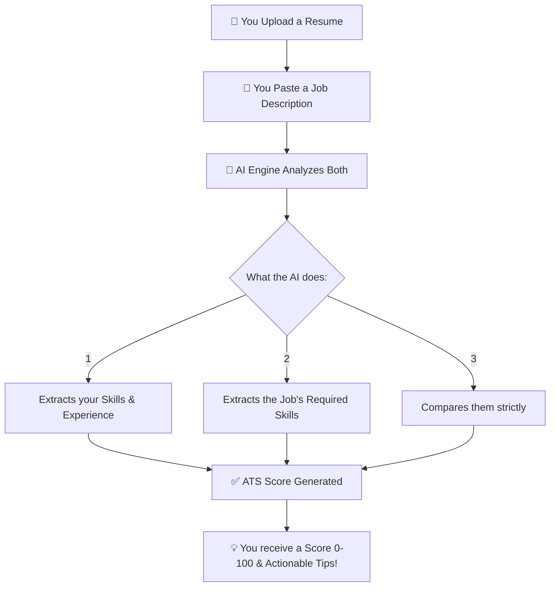
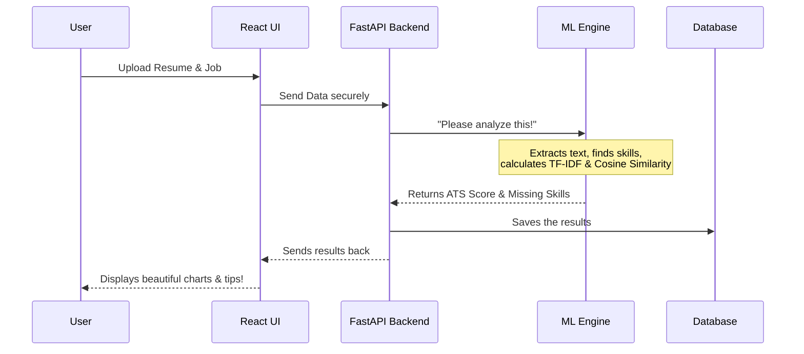

# 🚀 AI-Powered Resume Optimizer & Job Aligner

[](https://www.ai-resume-optimizer.store/)

> A smart tool that reads your resume, compares it to a job description, and tells you exactly how to improve your chances of getting hired!

---

## 🧐 What is this?

When you apply for a job, companies use software called an **ATS (Applicant Tracking System)** to filter out resumes. If your resume doesn't have the right keywords or skills, a human might never even see it!

This application acts like your personal ATS. It uses Artificial Intelligence to:
1. **Read** your resume.
2. **Read** the job you want.
3. **Score** how well they match.
4. **Tell you exactly what to fix** so you can get the interview.

## 🤔 Why was it built? (The Market Gap)

The job hunting process is broken. Job seekers send hundreds of applications into the "black box" of ATS (Applicant Tracking Systems) and get automatically rejected without ever knowing why. 

While there are other resume scanners on the market (like Jobscan or Resume Worded), our software was built to solve **critical gaps** that those platforms ignore:

1. **100% Deterministic Transparency:** Existing tools hide their scoring algorithms behind paywalls and give arbitrary scores. Our system is completely transparent—if you lost points, we tell you *exactly* which skill was missing from the job description so you can fix it.
2. **Beyond a Single Job Match (Career Discovery):** Other tools only compare you to *one* job at a time. Our system extracts your skills and cross-references them against an internal database of 25+ professional career paths, telling you what *other* jobs you are highly qualified for!
3. **Data Privacy (No Cloud API Leaks):** Many modern tools send your private resume (full of personal data) to third-party LLMs like OpenAI. Our ML Engine uses local NLP tokenization (`spaCy`) and `scikit-learn` to process your resume directly on our server, ensuring your data is never leaked to public AI models.
4. **Smart Anti-Spam Validation:** Unlike basic scanners that will happily "score" a blank page or a grocery list, our engine runs strict structural validation to ensure the uploaded document is an actual resume before wasting compute power.
5. **Engineering Rigor Over API Wrappers (Our Core Motivation):** A major goal of this project was to step away from the current market trend of simply wrapping "ChatGPT" in a UI. We wanted to build the architecture from the ground up to deeply understand the engineering behind **PDF data extraction**, **Deterministic Natural Language Processing**, and **Algorithmic Scoring** rather than relying entirely on black-box APIs.

### ☁️ Why do we call it a "SaaS"?

You might notice "SaaS" (Software as a Service) in our project title. This project is specifically designed as a complete, cloud-hosted SaaS platform rather than a standard local script because:

A normal script runs on one computer for one person. A **SaaS** runs on the internet and provides a service to many people at once. Our project is a SaaS because:

1. **Anyone can use it anywhere:** It is hosted on a real server (Google Cloud) with a real website domain. Users don't need to download code; they just open their browser.
2. **Multiple Accounts (Multi-user):** Hundreds of different people can create their own private accounts at the same time without seeing each other's data.
3. **It remembers you:** It has a secure database that saves your past resume scores, history, and profile in your own personal dashboard.
4. **Admin Panel:** It has a built-in management system where owners can log in, see registered users, and approve reviews.


## 🛠️ How does it work?



---

## ✨ Key Features (Simple View)

- **Resume Reader:** Upload a PDF or Word doc, and we read the text automatically.
- **Smart Validation:** It knows if you uploaded a fake resume (like a grocery receipt) and will reject it!
- **Strict Scoring Engine:** We don't guess. If the job needs "Python" and you don't have it, we tell you.
- **Career Path Analysis:** Wondering what else you can do? We match your skills to over 100 different careers!
- **📧 Secure Email Auth:** Complete with Email Verification and Password Resets. No unverified users allowed!
- **🛡️ Admin Dashboard & RBAC:** Role-Based Access Control to manage users and approve reviews.
- **⭐ User Reviews System:** Let users leave ratings, and admins approve them for public display.
- **Your History:** A dashboard that saves all your past scores so you can track your improvement.
- **Production-Ready:** Built to deploy effortlessly on **Google Cloud** (VPS) with a custom domain via **Hostinger**.

---

## 👩‍💻 For Teachers, Developers & Nerds

If you want to look under the hood, here is how the system is actually built.

### The System Workflow



### 📚 Detailed Documentation Links

We have separated the highly technical stuff into the `Docs/` folder so it's easy to find exactly what you need:

| [🎨 UI Rebranding](Docs/UI_REBRANDING.md) | **Latest v2.0**: Premium design system, animations, and reporting fixes. |
| [📖 API Reference](Docs/API.md) | For developers: Exact endpoints, request/response formats. |
| [🏗️ Architecture](Docs/ARCHITECTURE.md) | System design, ML algorithms, tech stack details. |
| [🗄️ Database](Docs/DATABASE.md) | Table structures and ER diagrams. |
| [🚀 Setup Guide](Docs/SETUP.md) | How to run this on your own computer (Docker & Local). |
| [🎓 Teacher Demo](Docs/TEACHER_DEMO.md) | A step-by-step guide on how to present this project and prove it works. |
| [💻 Terminal Commands](Docs/TERMINAL.md) | Cheat sheet for quick commands. |

---

## 🚀 Deployment & Quick Start

This project is built for professional production deployment using **Docker** and modern platforms like **Google Cloud** (VPS) and **Hostinger** (Domain & SMTP).

### 🐳 Production Deployment (Docker / VPS)

The easiest way to run the app in production is using Docker Compose.

```bash
# 1. Download the code
git clone https://github.com/anmol-ibrar-edu/AI-Based-Resume-Optimization-and-Job-Description-Alignment-SaaS-Product.git
cd AI-Based-Resume-Optimization-and-Job-Description-Alignment-SaaS-Product

# 2. Start the magic!
docker-compose up -d --build
```
Once it's done:
- **Use the App:** Go to [http://localhost](http://localhost) in your browser.
- **See the backend API:** Go to [http://localhost:8000/docs](http://localhost:8000/docs).

*(For local manual installation or setting up SMTP for emails, see [SETUP.md](Docs/SETUP.md))*

---

## 🤖 Optional: Make it even smarter with AI (Gemini/OpenAI)

This app works **100% offline** using our built-in Machine Learning. But if you want it to be *super* smart (like understanding synonyms or generating personalized summaries), you can plug in an API key!

1. Get a free Google Gemini key from [Google AI Studio](https://aistudio.google.com/).
2. Create a file called `.env` in the `backend/` folder.
3. Add this:
```env
GOOGLE_API_KEY=your-key-here
AI_SERVICE_PREFERRED=gemini
USE_AI_PARSING=True
```

*(If the AI ever fails or the internet drops, our app automatically switches back to the offline ML engine, so it never breaks!)*

---

*Built with ❤️ using FastAPI, React, PostgreSQL, and Machine Learning*
